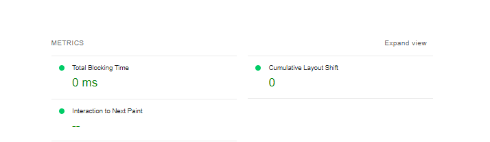

# React Performance Patterns
## **About The Project**
This react app uses mix of Design & Performance Patterns
### Performance Patterns

* [List Virtualization](https://www.patterns.dev/posts/virtual-lists/): one of the main Performance Patterns, 
    In simple words **how you can display large lists of data efficiently** by focusing on rendering just items visible to user.

    In this project we use a performant and versatile virtualized masonry grid for React called [Masonic](https://reactjs.org/) which based on [react-virtualized](https://github.com/bvaughn/react-virtualized).

* [Optimize loading third-parties](https://www.patterns.dev/posts/third-party/) Lazy loading all images by providing **loading** attribute *lazy* which means load images only when user scroll to them.


### Design Patterns

* [Hooks Design Pattern](https://www.patterns.dev/posts/hooks-pattern/)
    We use some built-in React Hooks " ```useState```, ```useEffect```,  ```useCallback```, ```useRef``` " in addition to some hooks provided by [Masonic](https://github.com/jaredLunde/masonic/) like " ```useContainerPosition```, ```useMasonry```, ```usePositioner```, ```useScroller``` " , which allows us to use React state and lifecycle methods without having to use a ES2015 class components.

## **Built With**

* [React](https://reactjs.org/)
* [TypeScript](https://www.typescriptlang.org/)
* [Masonic](https://github.com/jaredLunde/masonic/)

## **Data**
* We use a free public API from [TVMAZE](https://www.tvmaze.com/) which returns all popular shows with all info we need.

## **Getting Started**
### Installation
1. Clone the repo

   ```sh
   git clone https://github.com/MohamedSaber19/react-performance-patterns.git
   ```

2. Install NPM packages

   ```sh
   npm install
   ```

3. Run the App

   ```sh
   npm run devstart
   ```   
    This will run the app in the development mode.\
    Open [http://localhost:3000](http://localhost:3000) to view it in the browser.

### **Performance Metrics**

We used Chrome **Lighthouse** extension in the browser dev tools to measure performance after implementing the virtualization and below a screenshot of the report on desktop version **Timespan** mode



You can have your own report by navigating to **Lighthouse** tab in dev tools then select *Timespan* mode and select the device desktop/mobile and then check *performance* checkbox from categories section then click on **Start timespan** button.

### **Notes**

* The app is fully responsive on all screens.
* You can check the virtualization by inspecting the grid in the Elements tab in dev tools, you will see that only few divs rendered within the viewport and while you scroll more divs are rendered and replace the out-of-viewport divs. 


### **Demo**

You can check the live production build [here](https://movies-masonry.herokuapp.com/)